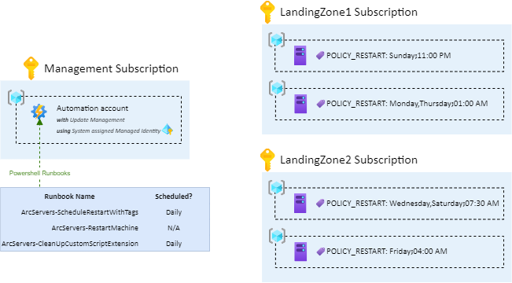

# Azure ARC Servers - Schedule machines restart with tags 

This repo is a set of Runbooks that allows you to schedule weekly Azure ARC Servers restarts by simply applying a `POLICY_RESTART` tag on Azure ARC Servers.

- [Azure ARC Servers - Schedule machines restart with tags](#azure-arc-servers---schedule-machines-restart-with-tags)
- [Global Picture](#global-picture)
  - [`POLICY_RESTART` syntax](#policy_restart-syntax)
  - [Prerequisites](#prerequisites)
  - [Runbooks details](#runbooks-details)
- [Authors](#authors)

# Global Picture

Shared Runbooks need the following initial bricks to work:
* An Automation Account 
  * The Automation account must use a **System-assigned Managed Identity**
  * The System-assigned Managed Identity must have **Contributor** role 
    * assigned on all subscriptions where Azure ARC Servers can be found
    * assigned to the Resource Group where the Automation Account is located

## `POLICY_RESTART` syntax 

Here is the syntax to follow for the `POLICY_RESTART` tag: `DaysOfWeek;rebootTime`

You can provide multiple days but they must be **comma separated**.

**Examples**:
* Server1 - `POLICY_RESTART= Sunday;11:00 PM` will be restart every Sunday, at 11:00 PM.
* Server2 - `POLICY_RESTART= Monday,Thursday;01:00 AM` will be restarted every Monday and Thursday at 01:00 AM.
* Server3 - `POLICY_RESTART= Wednesday,Saturday;07:30 AM` will be restarted every Wednesday and Saturday at 07:30 AM.
* Server4 - `POLICY_RESTART= Friday;04:00 AM` will be restarted every Friday at 04:00 AM.

Portal screenshot:

## Prerequisites

Automation Account must have the following modules installed:
* Az.ResourceGraph, >= 0.11.0
* Az.ConnectedMachine >= 0.2.0

**Note**: Runbooks must be deployed using Powershell Runtime v5.1 

## Runbooks details

There is a set of 3 Runbooks that must be deployed in the Automation Account:
* **ArcServers-ScheduleRestartWithTags**: Must be scheduled (at least) daily. Searches for all machines with the `POLICY_RESTART` tag and creates reboot schedules with *ArcServers-RestartMachine* Runbook.
* **ArcServers-RestartMachine**: Restarts a given Azure ARC Server. To perform the restart, the runbook deploy a CustomScript (*linux* machines) or CustomScriptExtension (*windows* machines) extensions on Azure ARC Server.
* **ArcServers-CleanUpCustomScriptExtension**: Must be scheduled (at least) daily. Removes old CustomScript (*linux* machines) or CustomScriptExtension (*windows* machines) extensions on Azure ARC Servers.
  
# Authors

[David Santiago](https://github.com/dawlysd) & [Nicolas Ghirardi](https://www.linkedin.com/in/nicolas-ghirardi-11090235) 
